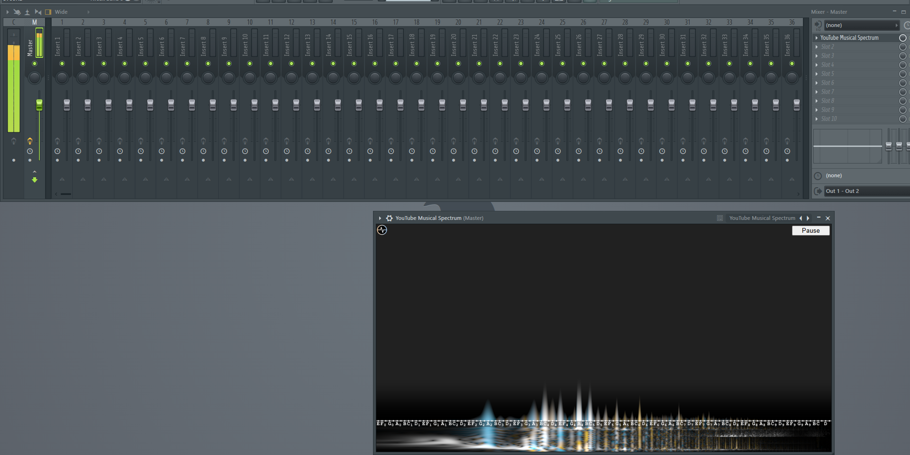
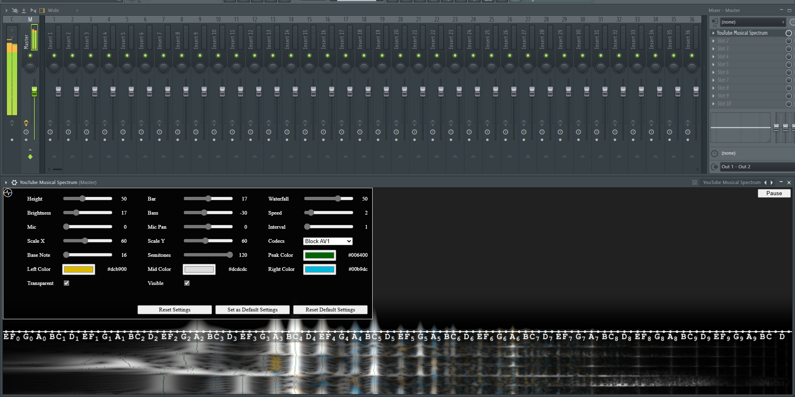
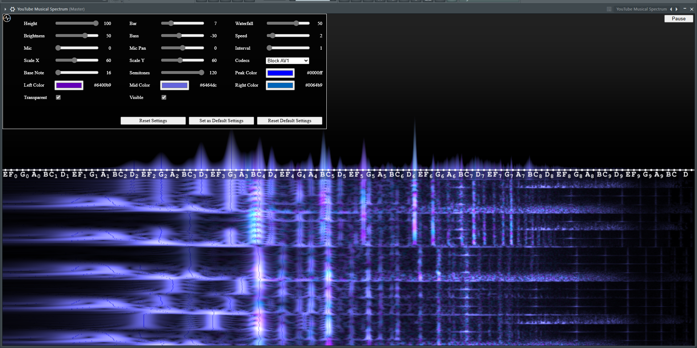
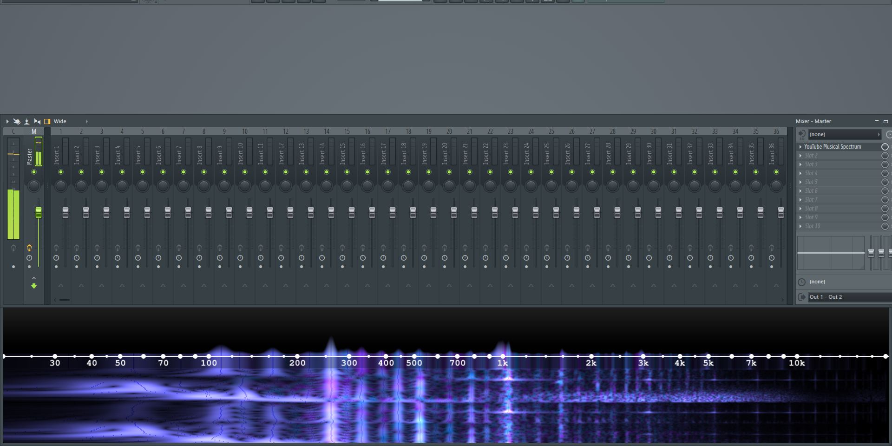
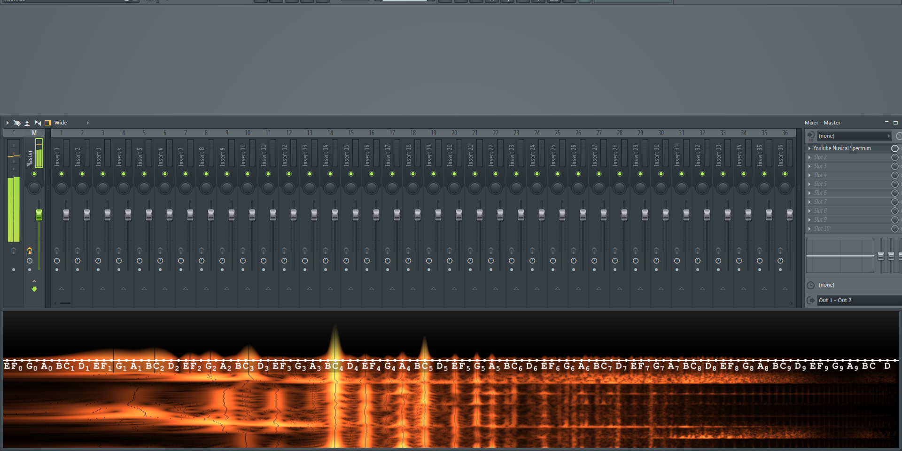

# YouTube Musical Spectrum as a DAW Plugin

This plugin is a wrapper of [YouTube Musical Spectrum](https://github.com/mfcc64/youtube-musical-spectrum) browser extension.

## Install

- Go to [Releases Page](https://github.com/mfcc64/youtube-musical-spectrum-daw/releases).
- Currently, the only available binary format is VST3 on Windows 64 bits.
- Download the ZIP file.
- Copy `youtube-musical-spectrum.vst3` to VST3 plugin folder (usually `C:\Program Files\Common Files\VST3\`).
- Rescan plugins on your DAW.

## Settings

- Go to [YouTube Musical Spectrum Settings](https://github.com/mfcc64/youtube-musical-spectrum#settings).
- At the top right corner, click `Pause` button to pause the spectrogram.

## Screenshots

